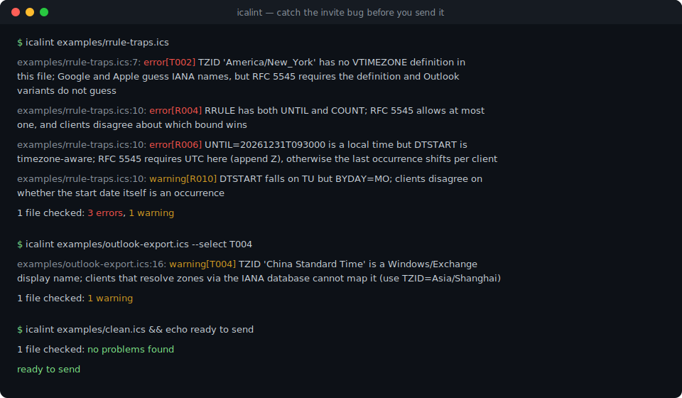
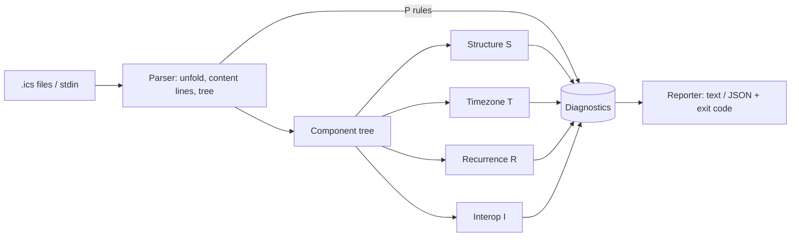

# icalint

[English](README.md) | [中文](README.zh.md) | [日本語](README.ja.md)

[](LICENSE) [](CHANGELOG.md) [](pyproject.toml)  [](CONTRIBUTING.md)

**オープンソースの iCalendar（.ics）ファイル linter——浮動時刻、欠落した VTIMEZONE、RRULE の罠、相互運用性を壊す要因を、招待を送る前にすべて検出する。**



```bash
git clone https://github.com/JaydenCJ/icalint && cd icalint && pip install -e .
```

> **プレリリース：** icalint はまだ PyPI に公開されていません。初回リリースまでは [JaydenCJ/icalint](https://github.com/JaydenCJ/icalint) をクローンし、リポジトリのルートで `pip install -e .` を実行してください。ランタイム依存ゼロ——クローンだけで動きます。

## なぜ icalint？

あらゆるカレンダーシステムが iCalendar を話しますが、同じ方言を話すものはほぼ存在しません。タイムゾーンのない `DTSTART` は参加者のデバイスごとに異なる絶対時刻で表示され、Windows のゾーン名（"China Standard Time"）を名乗る `TZID` は Outlook の外では解決不能で、`UNTIL` と `COUNT` を両方持つ `RRULE` は明白な仕様違反なのに生成側は平気で出力し、どちらの境界が勝つかはクライアントごとに意見が割れます。これらのバグはすべてのパーサーを通過し、あらゆる往復テストを生き延び、最後は「ロンドンオフィスでは会議が 3 時間ずれて見える」という形でだけ表面化します。既存ツールでは捕まえられません：`icalendar` と `ics.py` はパーサーであり、ファイルが*読める*ことは教えてくれても*安心して送れる*ことは保証せず、定番のオンラインバリデータは文法しか見ず、ブラウザが必要で、CI には入れられません。icalint はその欠けていた linter です：RFC 5545 が厳格な箇所、実際のクライアントが仕様から逸脱する箇所、そして今踏もうとしているのがどちらなのかを、安定 ID 付きの 54 ルールに記述し、終了コード・JSON 出力・ルール単位の選択で CI に組み込めます。

|  | icalint | icalendar（ライブラリ） | ics.py（ライブラリ） | icalendar.org バリデータ |
|---|---|---|---|---|
| 相互運用性の危険を診断 | あり——54 ルール・安定 ID | なし——解析と往復のみ | なし——解析と往復のみ | 構文エラーのみ |
| タイムゾーンの罠（浮動時刻、Windows TZID、VTIMEZONE 欠落） | あり | なし | なし | なし |
| RRULE の罠の分析（UNTIL/COUNT、UTC 規則、パターン不一致） | あり | なし | なし | なし |
| CI 対応：終了コード、JSON 出力、ルール選択/除外 | あり | 対象外（ライブラリ） | 対象外（ライブラリ） | なし（Web フォーム） |
| オフラインで動作 | あり | あり | あり | なし |
| ランタイム依存 | 0 | 2 | 5 | 対象外（ホスト型） |

<sub>依存数は 2026-07 時点で各パッケージが PyPI に宣言しているランタイム要件：icalendar 6.x（python-dateutil、tzdata）、ics 0.7.x（arrow、python-dateutil、attrs、six、tatsu）。icalint の数値は [pyproject.toml](pyproject.toml) の `dependencies = []` によるものです。</sub>

## 特長

- **パーサーが素通しするバグを検出**——浮動ローカル時刻、`VTIMEZONE` のない `TZID`、IANA の置き換え候補まで提示する Windows ゾーン名、`UNTIL`+`COUNT` の衝突、自身の繰り返しパターンに一致しない `DTSTART`。
- **54 ルール・安定 ID・固定重大度**——`error` は RFC 違反、`warning` は移植性の危険、`info` は意図的なら許容できるパターン；ID（`T001`）でもカテゴリ丸ごと（`R`）でも選択・抑制が可能。
- **CI のために設計**——linter 慣例の終了コード、`--fail-on` しきい値、機械可読な JSON、grep しやすい `path:line: severity[ID] message` 形式のテキスト出力。
- **寛容に解析し、正確に指摘**——壊れた 1 行が後続の 20 個の問題を隠すことはなく、すべての指摘は原因となった物理行を指します。折り畳み行も例外ではありません。
- **設計から決定的**——タイムゾーン DB・時計・ロケール・ネットワークに一切触れず、同じファイルはどのマシンでも永遠にバイト単位で同一の結果を生みます。
- **ランタイム依存ゼロ**——純粋な Python 標準ライブラリのみ、`pip install` 一回で完了、ピン留め不要；開発依存は pytest だけです。

## クイックスタート

インストール：

```bash
git clone https://github.com/JaydenCJ/icalint && cd icalint && pip install -e .
```

同梱の例で、最もありふれたカレンダーのバグ——時刻が浮動している会議——を確認します：

```bash
icalint examples/floating-time.ics
```

出力（実際の実行から転記）：

```text
examples/floating-time.ics:7: warning[T001] DTSTART 20260714T190000 is a floating local time; every attendee's client renders it in its own timezone - add a TZID parameter or use UTC (trailing Z)
examples/floating-time.ics:8: warning[T001] DTEND 20260714T200000 is a floating local time; every attendee's client renders it in its own timezone - add a TZID parameter or use UTC (trailing Z)
1 file checked: 2 warnings
```

終了コードは 1 なので、CI ステップはこのコマンドそのものです。機械向けには同じ指摘を JSON で出力できます：

```bash
icalint --format json examples/floating-time.ics
```

```text
{
  "files": [
    {
      "diagnostics": [
        {
          "line": 7,
          "message": "DTSTART 20260714T190000 is a floating local time; every attendee's client renders it in its own timezone - add a TZID parameter or use UTC (trailing Z)",
          "rule": "T001",
          "severity": "warning"
        },
        {
          "line": 8,
          "message": "DTEND 20260714T200000 is a floating local time; every attendee's client renders it in its own timezone - add a TZID parameter or use UTC (trailing Z)",
          "rule": "T001",
          "severity": "warning"
        }
      ],
      "path": "examples/floating-time.ics"
    }
  ],
  "summary": {
    "error": 0,
    "files_checked": 1,
    "info": 0,
    "warning": 2
  }
}
```

ディレクトリは再帰的に `.ics` ファイルを走査し、`-` は stdin を lint します——`curl` で取得したフィードやエクスポート工程をそのままパイプできます。

## ルール

5 カテゴリ全 54 ルール、それぞれに安定 ID と固定重大度があります。判断の根拠まで含む完全なリファレンスは [`docs/rules.md`](docs/rules.md) にあります。

| 接頭辞 | カテゴリ | 例 |
|---|---|---|
| `P` | 解析層 | 裸の LF 改行、折り畳まれていない 75 オクテット超の行、不均衡な BEGIN/END |
| `S` | 構造 | UID/DTSTAMP/VERSION の欠落、単一属性の重複、不正な日付 |
| `T` | タイムゾーン | 浮動時刻、VTIMEZONE 欠落、Windows TZID、UTC 値への TZID |
| `R` | 繰り返し | UNTIL/COUNT 衝突、非 UTC の UNTIL、数値 BYDAY の誤用、孤児オーバーライド |
| `I` | 相互運用 | DTEND+DURATION、mailto でない ORGANIZER、METHOD の契約、TEXT エスケープ |

## CLI オプション

| フラグ | 既定値 | 効果 |
|---|---|---|
| `--format text\|json` | `text` | 人間向けの行、または安定した JSON ドキュメント |
| `--select RULES` | 全ルール | この ID/接頭辞だけ実行、例 `--select T,R010` |
| `--ignore RULES` | なし | この ID/接頭辞を抑制 |
| `--min-severity LEVEL` | `info` | `info`/`warning`/`error` 未満の指摘を非表示 |
| `--fail-on LEVEL` | `warning` | このレベル以上で終了コード 1；`never` は常に 0 |
| `--list-rules` | — | 全ルールの ID・重大度・要約を表示 |

終了コード：`0` はクリーン（`--fail-on` しきい値未満）、`1` は指摘あり、`2` は使い方または I/O エラー。

## 検証

このリポジトリは CI を同梱しません。上記の主張はすべてローカル実行で検証されています。このリポジトリのチェックアウトから再現できます：

```bash
pip install -e '.[dev]' && pytest && bash scripts/smoke.sh
```

出力（実際の実行から転記、`...` で省略）：

```text
91 passed in 0.79s
...
[rrule] 1 file checked: 3 errors, 1 warning
SMOKE OK
```

## アーキテクチャ



## ロードマップ

- [x] 寛容なパーサー、5 カテゴリ 54 ルール、CI 対応 CLI、JSON 出力、Python API（v0.1.0）
- [ ] PyPI 公開、`pip install icalint` 対応
- [ ] 機械的修復を行う `--fix` モード：CRLF、折り畳み、`VALUE=DATE`、mailto 接頭辞
- [ ] VTIMEZONE 観測データの検証（参照ゾーンに対するオフセットと切替規則）
- [ ] VALARM・VFREEBUSY 専用のルールパック
- [ ] pre-commit フックとエディタ（LSP）統合

完全なリストは [open issues](https://github.com/JaydenCJ/icalint/issues) を参照してください。

## コントリビュート

コントリビュートを歓迎します——まずは [good first issue](https://github.com/JaydenCJ/icalint/issues?q=is%3Aissue+is%3Aopen+label%3A%22good+first+issue%22) から始めるか、[discussion](https://github.com/JaydenCJ/icalint/discussions) を立ててください。開発環境の構築は [CONTRIBUTING.md](CONTRIBUTING.md) を参照してください。

## ライセンス

[MIT](LICENSE)
