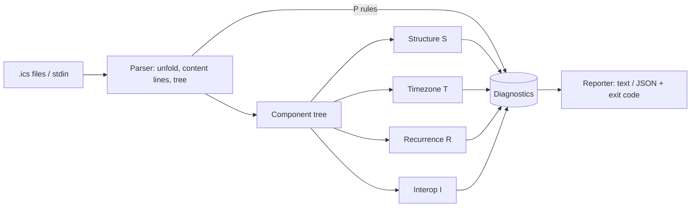

# icalint

[English](README.md) | [中文](README.zh.md) | [日本語](README.ja.md)

[](LICENSE) [](CHANGELOG.md) [](pyproject.toml)  [](CONTRIBUTING.md)

**An open-source linter for iCalendar (.ics) files — floating times, missing VTIMEZONEs, RRULE traps, and interop breakers, caught before the invite goes out.**


```bash
git clone https://github.com/JaydenCJ/icalint && cd icalint && pip install -e .
```

> **Pre-release:** icalint is not yet published to PyPI. Until the first release, clone [JaydenCJ/icalint](https://github.com/JaydenCJ/icalint) and run `pip install -e .` from the repository root. Zero runtime dependencies — the clone is all you need.

## Why icalint?

Every calendar system speaks iCalendar, and almost none of them speak it the same way. A `DTSTART` without a timezone renders at a different absolute time on every attendee's device; a `TZID` naming a Windows zone ("China Standard Time") is unresolvable outside Outlook; an `RRULE` with both `UNTIL` and `COUNT` is flat-out invalid, yet producers emit it and clients disagree about which bound wins. These bugs pass every parser, survive every round-trip test, and only surface as "the meeting shows 3 hours off for the London office." The existing tooling cannot catch them: `icalendar` and `ics.py` are parsers — they tell you the file is *readable*, not that it is *safe to send* — and the classic online validator checks grammar, needs a browser, and cannot run in CI. icalint is the missing linter: 54 rules with stable ids that encode where RFC 5545 is strict, where real clients diverge from it, and which of the two you are about to trip over, wired for CI with exit codes, JSON output, and per-rule selection.

|  | icalint | icalendar (lib) | ics.py (lib) | icalendar.org validator |
|---|---|---|---|---|
| Diagnoses interop hazards | Yes — 54 rules, stable ids | No — parses and round-trips | No — parses and round-trips | Syntax errors only |
| Timezone traps (floating times, Windows TZIDs, missing VTIMEZONE) | Yes | No | No | No |
| RRULE trap analysis (UNTIL/COUNT, UTC rules, pattern mismatch) | Yes | No | No | No |
| CI-ready: exit codes, JSON output, rule select/ignore | Yes | n/a (library) | n/a (library) | No (web form) |
| Works offline | Yes | Yes | Yes | No |
| Runtime dependencies | 0 | 2 | 5 | n/a (hosted) |

<sub>Dependency counts are the declared runtime requirements on PyPI as of 2026-07: icalendar 6.x (python-dateutil, tzdata), ics 0.7.x (arrow, python-dateutil, attrs, six, tatsu). icalint's count is `dependencies = []` in [pyproject.toml](pyproject.toml).</sub>

## Features

- **Finds the bugs parsers bless** — floating local times, `TZID`s with no `VTIMEZONE`, Windows zone names with the exact IANA replacement suggested, `UNTIL`+`COUNT` conflicts, `DTSTART`s that miss their own recurrence pattern.
- **54 rules, stable ids, fixed severities** — `error` for RFC violations, `warning` for portability hazards, `info` for defensible-but-risky patterns; select or suppress by id (`T001`) or whole category (`R`).
- **Built for CI** — linter-conventional exit codes, a `--fail-on` threshold, machine-readable JSON, and grep-able `path:line: severity[ID] message` text output.
- **Forgiving parser, precise findings** — one broken line never hides the next twenty problems; every finding points at the physical line that caused it, folded lines included.
- **Deterministic by design** — no timezone database, no clock, no locale, no network: the same file produces byte-identical findings on every machine, forever.
- **Zero runtime dependencies** — pure Python standard library, one `pip install`, nothing to pin; pytest is the only dev dependency.

## Quickstart

Install:

```bash
git clone https://github.com/JaydenCJ/icalint && cd icalint && pip install -e .
```

Lint the shipped example of the single most common calendar bug — a meeting whose times are floating:

```bash
icalint examples/floating-time.ics
```

Output (copied from a real run):

```text
examples/floating-time.ics:7: warning[T001] DTSTART 20260714T190000 is a floating local time; every attendee's client renders it in its own timezone - add a TZID parameter or use UTC (trailing Z)
examples/floating-time.ics:8: warning[T001] DTEND 20260714T200000 is a floating local time; every attendee's client renders it in its own timezone - add a TZID parameter or use UTC (trailing Z)
1 file checked: 2 warnings
```

The exit code is 1, so a CI step is just the command itself. For machines, the same findings as JSON:

```bash
icalint --format json examples/floating-time.ics
```

```text
{
  "files": [
    {
      "diagnostics": [
        {
          "line": 7,
          "message": "DTSTART 20260714T190000 is a floating local time; every attendee's client renders it in its own timezone - add a TZID parameter or use UTC (trailing Z)",
          "rule": "T001",
          "severity": "warning"
        },
        {
          "line": 8,
          "message": "DTEND 20260714T200000 is a floating local time; every attendee's client renders it in its own timezone - add a TZID parameter or use UTC (trailing Z)",
          "rule": "T001",
          "severity": "warning"
        }
      ],
      "path": "examples/floating-time.ics"
    }
  ],
  "summary": {
    "error": 0,
    "files_checked": 1,
    "info": 0,
    "warning": 2
  }
}
```

Directories are scanned recursively for `.ics` files, and `-` lints stdin — handy for piping a feed straight from `curl` or an export step.

## Rules

54 rules in five categories, each with a stable id and a fixed severity. The full reference, including the reasoning behind the judgment calls, is in [`docs/rules.md`](docs/rules.md).

| Prefix | Category | Examples |
|---|---|---|
| `P` | Parse layer | bare LF endings, unfolded 75+ octet lines, unbalanced BEGIN/END |
| `S` | Structure | missing UID/DTSTAMP/VERSION, duplicate singletons, invalid dates |
| `T` | Timezones | floating times, missing VTIMEZONE, Windows TZIDs, TZID-on-UTC |
| `R` | Recurrence | UNTIL/COUNT conflicts, non-UTC UNTIL, numeric BYDAY misuse, orphan overrides |
| `I` | Interop | DTEND+DURATION, non-mailto ORGANIZER, METHOD contracts, TEXT escaping |

## CLI options

| Flag | Default | Effect |
|---|---|---|
| `--format text\|json` | `text` | Human-readable lines or a stable JSON document |
| `--select RULES` | all rules | Only run these ids/prefixes, e.g. `--select T,R010` |
| `--ignore RULES` | none | Suppress these ids/prefixes |
| `--min-severity LEVEL` | `info` | Hide findings below `info`/`warning`/`error` |
| `--fail-on LEVEL` | `warning` | Exit 1 at or above this level; `never` always exits 0 |
| `--list-rules` | — | Print every rule id, severity, and summary |

Exit codes: `0` clean (below the `--fail-on` threshold), `1` findings, `2` usage or I/O error.

## Verification

This repository ships no CI; every claim above is verified by local runs. Reproduce them from a checkout of this repository:

```bash
pip install -e '.[dev]' && pytest && bash scripts/smoke.sh
```

Output (copied from a real run, truncated with `...`):

```text
91 passed in 0.79s
...
[rrule] 1 file checked: 3 errors, 1 warning
SMOKE OK
```

## Architecture



## Roadmap

- [x] Forgiving parser, 54 rules across five categories, CI-ready CLI, JSON output, Python API (v0.1.0)
- [ ] PyPI release with `pip install icalint`
- [ ] `--fix` mode for mechanical repairs: CRLF, folding, `VALUE=DATE`, mailto prefixes
- [ ] VTIMEZONE observance validation (offsets and transition rules against the referenced zone)
- [ ] VALARM- and VFREEBUSY-specific rule packs
- [ ] pre-commit hook and editor (LSP) integration

See the [open issues](https://github.com/JaydenCJ/icalint/issues) for the full list.

## Contributing

Contributions are welcome — start with a [good first issue](https://github.com/JaydenCJ/icalint/issues?q=is%3Aissue+is%3Aopen+label%3A%22good+first+issue%22) or open a [discussion](https://github.com/JaydenCJ/icalint/discussions). See [CONTRIBUTING.md](CONTRIBUTING.md) for the development setup.

## License

[MIT](LICENSE)
