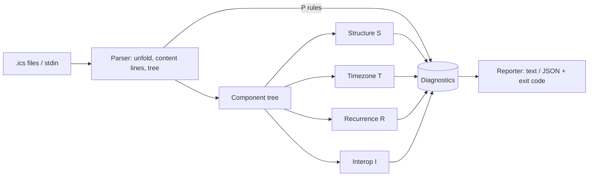

# icalint

[English](README.md) | [中文](README.zh.md) | [日本語](README.ja.md)

[](LICENSE) [](CHANGELOG.md) [](pyproject.toml)  [](CONTRIBUTING.md)

**开源的 iCalendar（.ics）文件 linter——浮动时间、缺失的 VTIMEZONE、RRULE 陷阱和互操作杀手，在邀请发出之前全部揪出来。**


```bash
git clone https://github.com/JaydenCJ/icalint && cd icalint && pip install -e .
```

> **预发布：** icalint 尚未发布到 PyPI。在首个正式版之前，请克隆 [JaydenCJ/icalint](https://github.com/JaydenCJ/icalint) 并在仓库根目录运行 `pip install -e .`。零运行时依赖——克隆下来就够了。

## 为什么选 icalint？

所有日历系统都讲 iCalendar，但几乎没有两家讲得一样。不带时区的 `DTSTART` 会在每位与会者的设备上渲染成不同的绝对时间；写着 Windows 时区名（"China Standard Time"）的 `TZID` 在 Outlook 之外根本无法解析；同时带 `UNTIL` 和 `COUNT` 的 `RRULE` 明确违反规范，可生产端照样在发，客户端对哪个边界生效各执一词。这些 bug 能通过所有解析器、扛住所有往返测试，最后只以"伦敦办公室看到的会议偏了 3 小时"的形式浮出水面。现有工具抓不住它们：`icalendar` 和 `ics.py` 是解析器——它们告诉你文件*可读*，而不是*可以放心发出*——而经典的在线校验器只查语法、需要浏览器、进不了 CI。icalint 是那个缺席已久的 linter：54 条带稳定编号的规则，写清了 RFC 5545 哪里严格、真实客户端哪里偏离规范、以及你即将踩中的是哪一种，并以退出码、JSON 输出和按规则筛选接入 CI。

|  | icalint | icalendar（库） | ics.py（库） | icalendar.org 校验器 |
|---|---|---|---|---|
| 诊断互操作隐患 | 是——54 条规则、稳定编号 | 否——只解析和往返 | 否——只解析和往返 | 仅语法错误 |
| 时区陷阱（浮动时间、Windows TZID、缺失 VTIMEZONE） | 是 | 否 | 否 | 否 |
| RRULE 陷阱分析（UNTIL/COUNT、UTC 规则、模式不匹配） | 是 | 否 | 否 | 否 |
| CI 就绪：退出码、JSON 输出、规则选择/忽略 | 是 | 不适用（库） | 不适用（库） | 否（网页表单） |
| 离线可用 | 是 | 是 | 是 | 否 |
| 运行时依赖 | 0 | 2 | 5 | 不适用（托管） |

<sub>依赖数为 2026-07 时各包在 PyPI 上声明的运行时依赖：icalendar 6.x（python-dateutil、tzdata）、ics 0.7.x（arrow、python-dateutil、attrs、six、tatsu）。icalint 的数字来自 [pyproject.toml](pyproject.toml) 中的 `dependencies = []`。</sub>

## 特性

- **抓住被解析器放行的 bug**——浮动本地时间、没有 `VTIMEZONE` 的 `TZID`、直接给出 IANA 替换建议的 Windows 时区名、`UNTIL`+`COUNT` 冲突、错过自身循环模式的 `DTSTART`。
- **54 条规则、稳定编号、固定严重级**——`error` 对应 RFC 违规，`warning` 对应可移植性隐患，`info` 对应说得通但有风险的写法；可按编号（`T001`）或整类（`R`）选择或屏蔽。
- **为 CI 而生**——linter 惯例的退出码、`--fail-on` 阈值、机器可读的 JSON，以及可 grep 的 `path:line: severity[ID] message` 文本输出。
- **解析宽容、定位精准**——一行坏数据绝不掩盖后面二十个问题；每条发现都指向肇事的物理行号，折叠行也不例外。
- **设计上完全确定**——不碰时区数据库、不看时钟、不管 locale、不连网络：同一份文件在任何机器上永远产生逐字节相同的结果。
- **零运行时依赖**——纯 Python 标准库，一次 `pip install`，无需锁定任何东西；pytest 是唯一的开发依赖。

## 快速上手

安装：

```bash
git clone https://github.com/JaydenCJ/icalint && cd icalint && pip install -e .
```

用自带示例演示最常见的日历 bug——一个时间处于浮动状态的会议：

```bash
icalint examples/floating-time.ics
```

输出（摘自真实运行）：

```text
examples/floating-time.ics:7: warning[T001] DTSTART 20260714T190000 is a floating local time; every attendee's client renders it in its own timezone - add a TZID parameter or use UTC (trailing Z)
examples/floating-time.ics:8: warning[T001] DTEND 20260714T200000 is a floating local time; every attendee's client renders it in its own timezone - add a TZID parameter or use UTC (trailing Z)
1 file checked: 2 warnings
```

退出码为 1，所以 CI 步骤就是这条命令本身。面向机器时，同样的发现可输出为 JSON：

```bash
icalint --format json examples/floating-time.ics
```

```text
{
  "files": [
    {
      "diagnostics": [
        {
          "line": 7,
          "message": "DTSTART 20260714T190000 is a floating local time; every attendee's client renders it in its own timezone - add a TZID parameter or use UTC (trailing Z)",
          "rule": "T001",
          "severity": "warning"
        },
        {
          "line": 8,
          "message": "DTEND 20260714T200000 is a floating local time; every attendee's client renders it in its own timezone - add a TZID parameter or use UTC (trailing Z)",
          "rule": "T001",
          "severity": "warning"
        }
      ],
      "path": "examples/floating-time.ics"
    }
  ],
  "summary": {
    "error": 0,
    "files_checked": 1,
    "info": 0,
    "warning": 2
  }
}
```

目录会被递归扫描其中的 `.ics` 文件，`-` 则从 stdin 读取——很适合把 `curl` 拉取的订阅源或导出步骤直接管道进来。

## 规则

五大类共 54 条规则，每条都有稳定编号和固定严重级。完整参考（含各处取舍的理由）见 [`docs/rules.md`](docs/rules.md)。

| 前缀 | 类别 | 示例 |
|---|---|---|
| `P` | 解析层 | 裸 LF 换行、未折叠的 75+ 字节行、不配对的 BEGIN/END |
| `S` | 结构 | 缺失 UID/DTSTAMP/VERSION、单例属性重复、非法日期 |
| `T` | 时区 | 浮动时间、缺失 VTIMEZONE、Windows TZID、TZID 叠加 UTC |
| `R` | 循环 | UNTIL/COUNT 冲突、非 UTC 的 UNTIL、数字 BYDAY 误用、孤儿覆盖 |
| `I` | 互操作 | DTEND+DURATION、非 mailto 的 ORGANIZER、METHOD 契约、TEXT 转义 |

## 命令行选项

| 参数 | 默认值 | 效果 |
|---|---|---|
| `--format text\|json` | `text` | 人类可读的行或稳定的 JSON 文档 |
| `--select RULES` | 全部规则 | 只运行这些编号/前缀，如 `--select T,R010` |
| `--ignore RULES` | 无 | 屏蔽这些编号/前缀 |
| `--min-severity LEVEL` | `info` | 隐藏低于 `info`/`warning`/`error` 的发现 |
| `--fail-on LEVEL` | `warning` | 达到该级别即退出 1；`never` 永远退出 0 |
| `--list-rules` | — | 打印每条规则的编号、严重级和摘要 |

退出码：`0` 干净（低于 `--fail-on` 阈值），`1` 有发现，`2` 用法或 I/O 错误。

## 验证

本仓库不附带 CI；上文的每一项声明都由本地运行验证。从本仓库的检出中复现：

```bash
pip install -e '.[dev]' && pytest && bash scripts/smoke.sh
```

输出（摘自真实运行，以 `...` 截断）：

```text
91 passed in 0.79s
...
[rrule] 1 file checked: 3 errors, 1 warning
SMOKE OK
```

## 架构



## 路线图

- [x] 宽容解析器、五大类 54 条规则、CI 就绪的 CLI、JSON 输出、Python API（v0.1.0）
- [ ] 发布到 PyPI，支持 `pip install icalint`
- [ ] `--fix` 模式做机械修复：CRLF、折叠、`VALUE=DATE`、mailto 前缀
- [ ] VTIMEZONE 观测数据校验（偏移量与切换规则对照所引用的时区）
- [ ] VALARM 与 VFREEBUSY 专属规则包
- [ ] pre-commit 钩子与编辑器（LSP）集成

完整列表见 [open issues](https://github.com/JaydenCJ/icalint/issues)。

## 参与贡献

欢迎贡献——从一个 [good first issue](https://github.com/JaydenCJ/icalint/issues?q=is%3Aissue+is%3Aopen+label%3A%22good+first+issue%22) 开始，或发起一个 [discussion](https://github.com/JaydenCJ/icalint/discussions)。开发环境搭建见 [CONTRIBUTING.md](CONTRIBUTING.md)。

## 许可证

[MIT](LICENSE)
